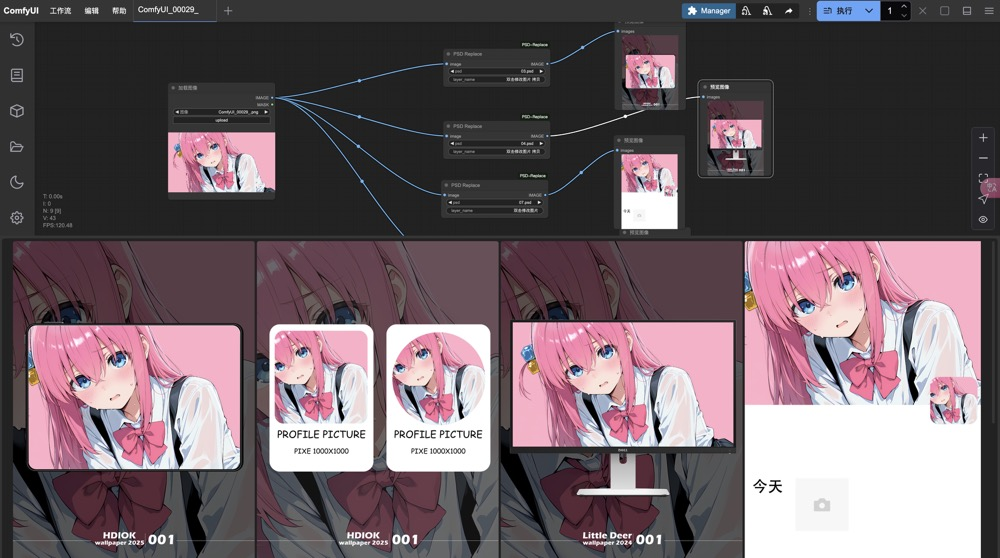
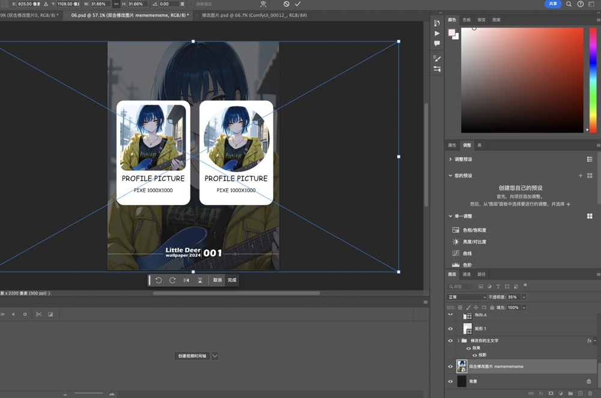

# ComfyUI-PSD-Replace

一键替换psd中的智能对象或者图层

替换源文件例子如下

[例子](./assets/example_psd_replace.json)


## 安装方法
1. 安装node环境
2. 安装canvas 所需的环境，详情见https://www.npmjs.com/package/canvas

3.
```
git clone git@github.com:lgldlk/ComfyUI-PSD-Replace.git
cd ComfyUI-PSD-Replace
npm install
```

#### 为什么需要node环境
在python中我没有找到合适的库，所以需要node环境来处理psd文件，如果有人知道python中可以更换psd图层的库，欢迎告诉我。